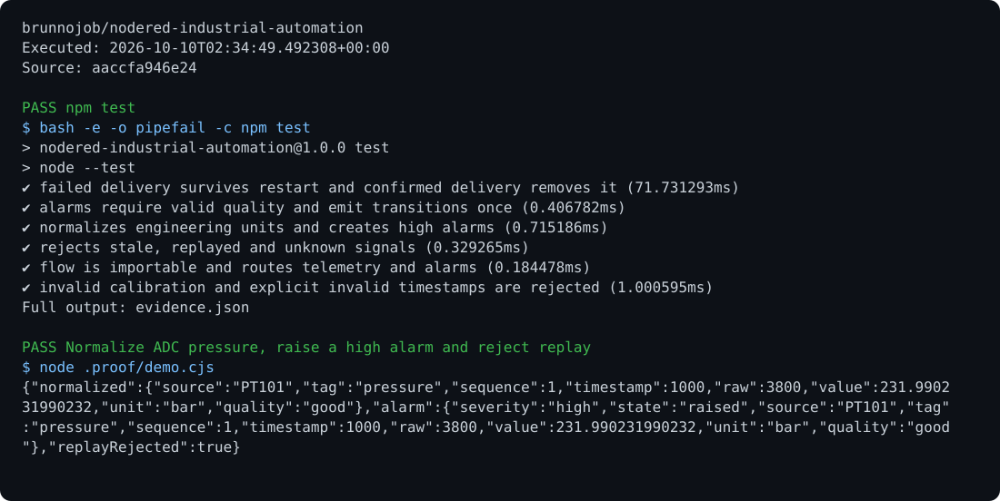

# Industrial Automation

[View execution evidence](https://brunnojob.github.io/devstart-lab/proofs/nodered-industrial-automation/)

An MQTT and Node-RED flow with engineering units, sequence tracking, quality checks, alarm hysteresis, and a persistent delivery queue.

## Run

Requirements: Node.js 24 and Node-RED.

```sh
npm ci
npm test
npm start
```

## Behavior

Configure the broker in `flows/offshore-telemetry.json`. `ARCHIVE_DIRECTORY` selects the local queue directory; `BRUNNODEV_ACCESS_TOKEN` authenticates synchronization. The flow persists data before sending and retains it until the server confirms persistence.

## Archive

The Node-RED flow uses `lib/archive.cjs` for its persistent delivery queue. Set `BRUNNODEV_ACCESS_TOKEN` before sending to the operations API.

## License

Original source and documentation are MIT licensed; see [LICENSE](LICENSE). Third-party dependencies and media retain their respective terms. Maintained by [Brunno Dev](https://brunnodev.store).

## Implementation update

Pipeline creation rejects non-finite or inverted calibration and hysteresis settings. Explicit invalid timestamps are rejected without consuming the source sequence. Run `npm test` from the repository root.

Contribution trailer: `Co-authored-by: nyctophile <33561761+ineedfoundmyway@users.noreply.github.com>`.

## Execution proof

[](https://github.com/brunnojob/nodered-industrial-automation/actions/workflows/proof.yml)



[Verified run](https://github.com/brunnojob/nodered-industrial-automation/actions/runs/38017971954) · [Execution report](docs/proof/evidence.json)

Run `python .proof/record.py` after installing the prerequisites above. The scenarios execute repository code and verify exit codes and expected output. CI publishes `execution-proof` with the transcript, input fingerprints and source commit. The downloadable report identifies the exact tested version; the workflow badge tracks the latest run.
